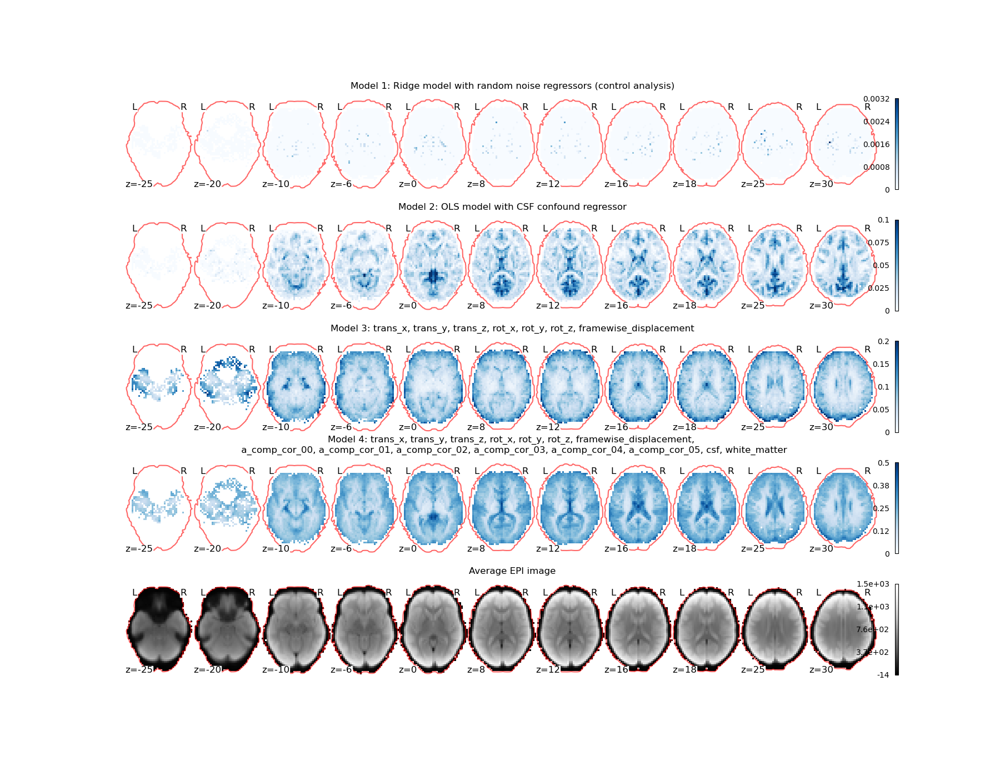
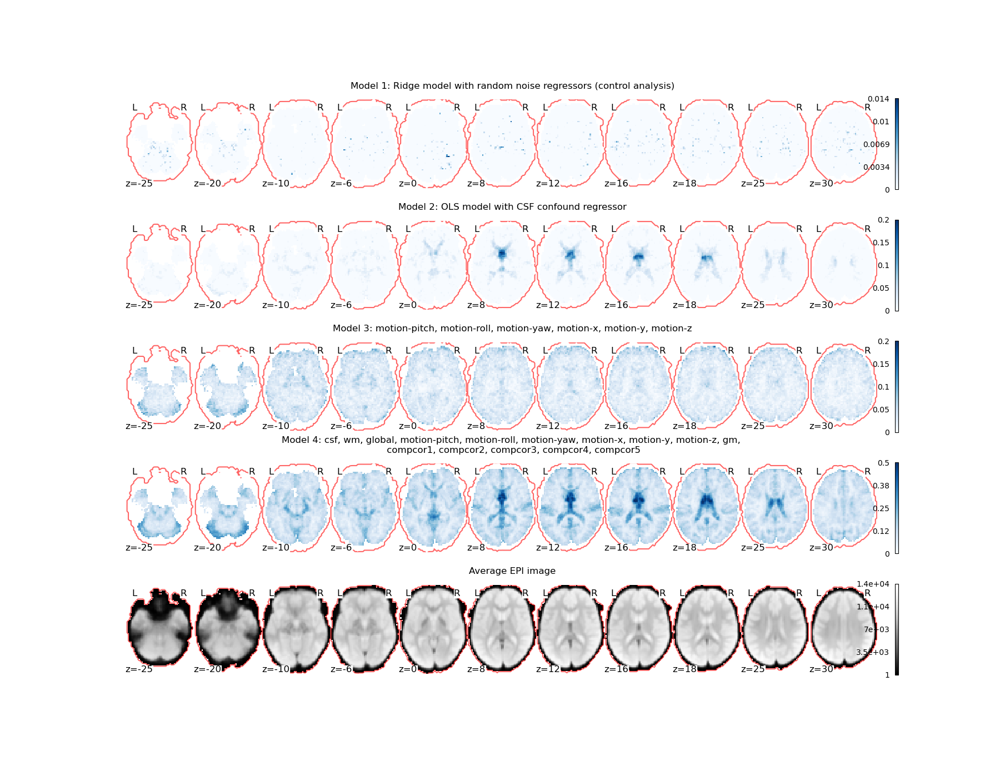
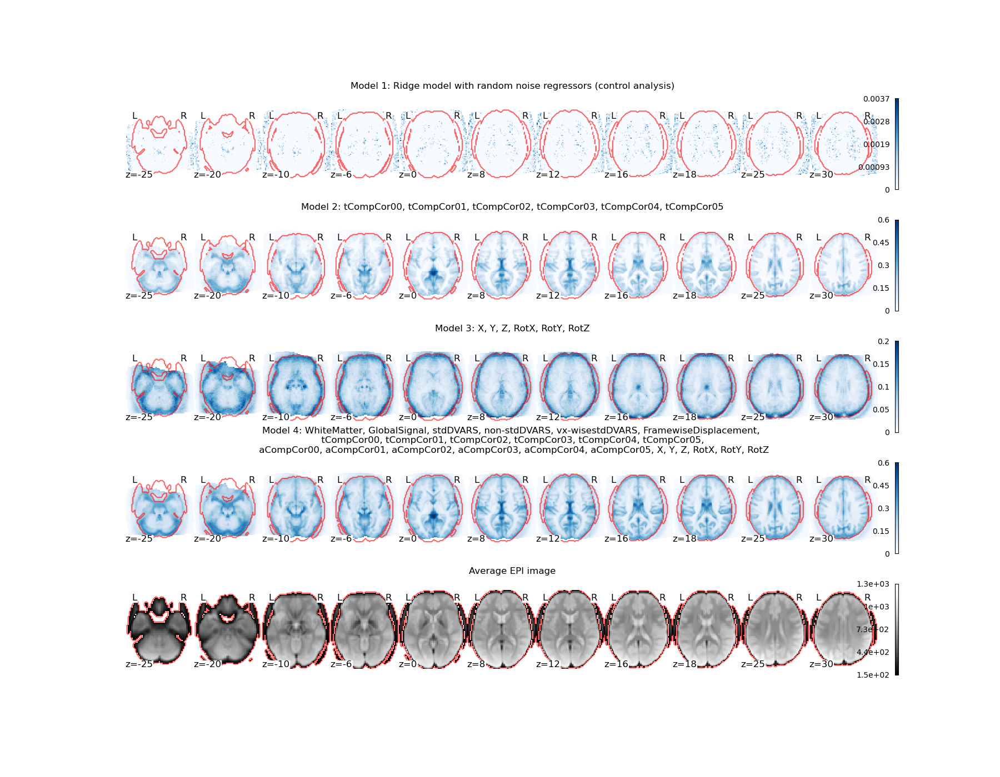

# fmri-nuisance-effects
Most fMRI preprocessing pipelines outputs confound signals 
that can be incorporated in subsequent denoising steps or in general linear
models. This repository contains a tool that can be useful for exploring associations between voxel time courses and the confounds signals.

#  Procedure
The algorithm consists of the following steps:

1. Import confound signals and functional data.
2. Apply high-pass filters to confound signals and to functional data.
3. Divide data into non-overlapping, but connected chunks.
4. Fit regression models that treat the confound signals as predictors and each voxel time course as target variable. Fit models to data from on all-but-one chunk and use such models to predict voxel time courses in held-out chunks. This is repeated for all chunks.
5. Evaluate goodness-of-fit in terms of coefficient of determination (R2)

Step 4 can be realized with ordinary least squares or with Ridge regression (see e.g., the example [[here](./examples/example01.py)). The latter can be useful when there are several (potentially correlated) confound signals. It is possible to specificy the hyperparameters of the Ridge
regression models. When numerous hyperparameters are specified, the algorithm will simply output the highest variance explained in each voxel. 

# Example 01
This example uses data available on https://openneuro.org/datasets/ds000228/versions/1.0.0.
Preprocessed data and confound signals are extracted from 155 participants. Different sets of 
confound signals are incorporated into the described framework. The four following models are considered:

* Model 1: Including only random noise signals as regressors in a Ridge regression model. This serves as a control.
* Model 2: Including CSF confound signal as single regressor in a OLS regression model.
* Model 3: Including 6 motion regressors in a Ridge regression model.
* Model 4: Including 6 motion regressors, one framewise displacement coefficient, 6 aCompCor coefficients, CSF, and WM confounds in a Ridge regression model.

Models are evaluated using a 5-fold cross-validation procedures. The models incorporate high-pass filters
with approximate cut-off of 1/128 Hz. Explained variance (R2) is extracted from each model and averaged
across all 155 participants. The results from the analysis are shown below. Code is available [here](./examples/example02.py)

# Example 02
This example uses data available on http://fcon_1000.projects.nitrc.org/indi/adhd200/index.html.
Preprocessed data and confound signals are extracted from 30 participants. Different sets of 
confound signals are incorporated into the described framework. The four following models are considered:

* Model 1: Including only random noise signals as regressors in a Ridge regression model. This serves as a control.
* Model 2: Including CSF confound signal as single regressor in a OLS regression model.
* Model 3: Including 6 motion regressors in a Ridge regression model.
* Model 4: Including 6 motion regressors, 6 CompCor coefficients, CSF, GM, WM and a global signal as confounds in a Ridge regression model.

Models are evaluated using a 5-fold cross-validation procedures. The models incorporate high-pass filters
with approximate cut-off of 1/128 Hz. Explained variance (R2) is extracted from each model and averaged
across all 30 participants. The results from the analysis are shown below. Code is available [here](./examples/example02.py)

# Example 03
This example uses data available on OpenfMRI (id: ds000030) described in https://www.nature.com/articles/sdata2016110.
Preprocessed data and confound signals are extracted from 261 participants. Different sets of 
confound signals are incorporated into the described framework. The four following models are considered:

* Model 1: Including only random noise signals as regressors in a Ridge regression model. This serves as a control.
* Model 2: Including 6 tCompCor coefficients in a Ridge regression model.
* Model 3: Including 6 motion regressors in a Ridge regression model.
* Model 4: Including 6 motion regressors, 6 aCompCor coefficients, 6 tCompCor coefficients, WM, global signal, stdVars, non-stdDVARS, vx-wisestdDVARS and a framewise displacement coefficient as confounds in a Ridge regression model.

Models are evaluated using a 5-fold cross-validation procedures. The models incorporate high-pass filters
with approximate cut-off of 1/128 Hz. Explained variance (R2) is extracted from each model and averaged
across all 261 participants. The results from the analysis are shown below. Code is available [here](./examples/example03.py)

# Installation
Install fmri-nuisance-effects using one of the following approaches:

1. Install directly from git: `pip install git+https://github.com/safugl/fmri-nuisance-effects.git`
2. Download the repository and run `pip install <local project path>`

# Authors

# References
Richardson, H., Lisandrelli, G., Riobueno-Naylor, A., & Saxe, R. (2018). Development of the social brain from age three to twelve years. Nature communications, 9(1), 1027. and include the following message 'This data was obtained from the OpenNeuro database. Its accession number is ds000228.'

Richardson, H., Lisandrelli, G., Riobueno-Naylor, A., & Saxe, R. (2018). Development of the social brain from age three to twelve years. Nature communications, 9(1), 1027.https://www.nature.com/articles/s41467-018-03399-2

Gorgolewski KJ, Durnez J and Poldrack RA. Preprocessed Consortium for Neuropsychiatric Phenomics dataset. F1000Research 2017, 6:1262
https://doi.org/10.12688/f1000research.11964.2

Poldrack, Russell A., et al. "A phenome-wide examination of neural and cognitive function." Scientific data 3.1 (2016): 1-12.

Pierre Bellec, Carlton Chu, François Chouinard-Decorte, Yassine Benhajali, Daniel S. Margulies, R. Cameron Craddock (2017). The Neuro Bureau ADHD-200 Preprocessed repository. NeuroImage, 144, Part B, pp. 275 - 286. doi:10.1016/j.neuroimage.2016.06.034
